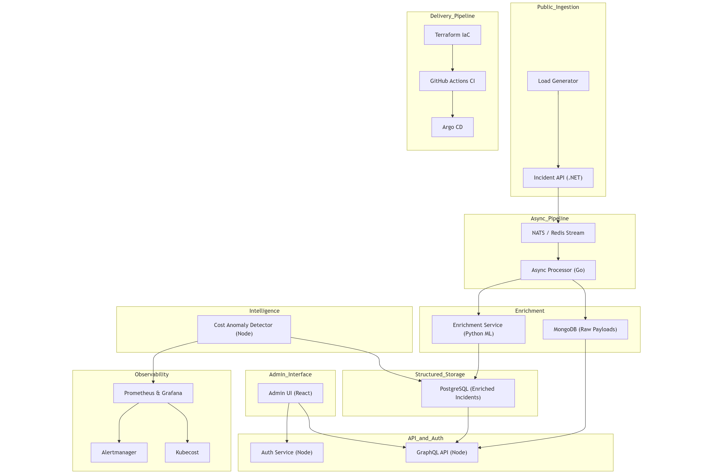

# Bugle Call Architecture

Bugle Call is a cloud-native platform designed to simulate real-world conditions in distributed system design, delivery, and operations. The architecture reflects a full-stack view across ingestion, enrichment, observability, and delivery workflows.

## Architecture Diagram
This diagram shows the main components and their interactions across functional domains. It includes ingestion and processing pipelines, AI-powered enrichment, multi-environment GitOps, and operational telemetry.

## Architecture Domains

### 1. Ingestion

- **Incident API (.NET):** Accepts incident payloads via HTTP POST, performs basic validation, and emits events to the async message stream.
- **Load Generator:** Simulates realistic traffic to test scalability and resilience.

### 2. Async Processing

- **NATS or Redis Stream:** Used for loosely coupled, high-performance event propagation.
- **Async Processor (Go):** Acts as the consumer of events, triggering enrichment and logging raw payloads.

### 3. AI Enrichment

- **Raw Payload Store (MongoDB):** Stores unstructured incident payloads for traceability, audit trails, and future model re-training.
- **Enrichment Service (Python):** Applies tagging, severity estimation, and metadata extraction using lightweight machine learning models.
- **Cost Anomaly Detector:** Processes telemetry from Prometheus and Kubecost to flag unusual cost patterns.

### 4. Storage

- **PostgreSQL:** Structured relational storage for enriched and normalized incident data used in dashboards and queries.

### 5. Visualization

- **Admin UI (React):** Internal dashboard for browsing and filtering incidents.
- **Auth Gateway (JWT):** Protects internal tools and manages session and role-based access.

### 6. Observability

- **Prometheus:** Captures metrics across services.
- **Grafana:** Visualizes trends and health metrics.
- **Alertmanager:** Issues alerts based on defined thresholds or failures.
- **Kubecost:** Tracks resource usage and provides cost analytics per environment.

### 7. Deployment

- **Terraform:** Infrastructure-as-Code for AKS, EKS, and local `kind` clusters.
- **GitHub Actions:** CI for testing and packaging.
- **ArgoCD:** GitOps delivery and multi-environment deployment promotion.
- **Kustomize:** Environment-specific overlays for dev, staging, and prod.

## Multi-Cloud Support

Bugle Call runs across multiple Kubernetes providers to simulate cloud-specific behavior:

- **AKS:** Role-based access, managed identity, Azure regional pricing
- **EKS:** IRSA, spot instances, AWS billing context
- **kind / k3d:** Local testing and GitOps pipeline validation

## Rationale

Bugle Call was designed not just as a reference architecture, but as a **practice environment** for architects who want to refine their skill in DevOps, infrastructure automation, cost awareness, and AI-based system intelligence.

By building and operating the entire pipeline, users can validate architectural decisions, uncover edge cases, and improve system understanding through direct implementation.

